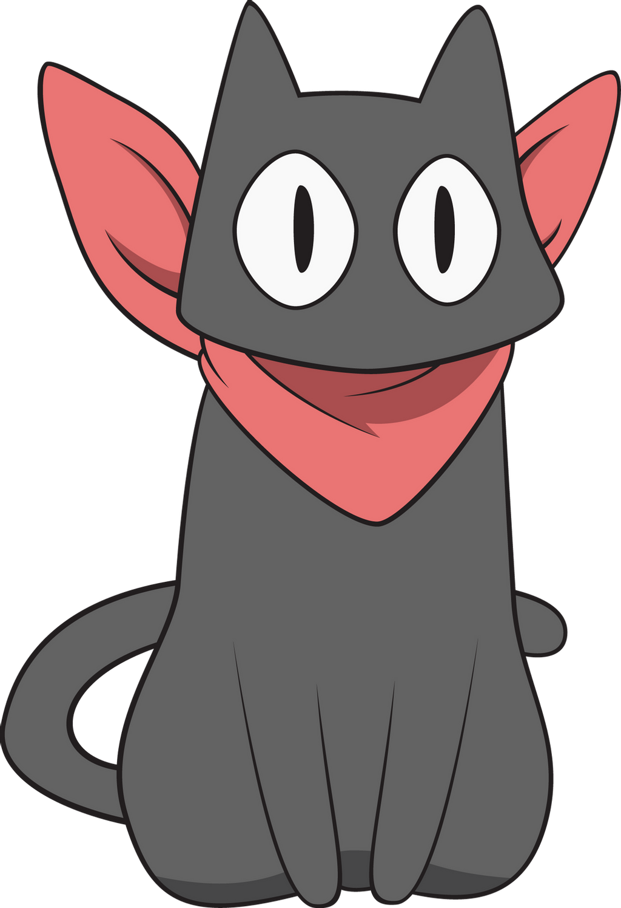

<h1 align="center">
  
   Sakamoto 
</h1>

A clash gui for linux.

## About

### The project name

[Clash](https://github.com/Dreamacro/clash), the base of this project, who's logo is a lovely cat which reminds me of another cat in anime [Nichijou](https://myanimelist.net/anime/10165/Nichijou) named sakamoto. This project is relative to clash so it's natural to have a cat name for it.

### The logo image

From [deviantart](https://www.deviantart.com/ror362/art/Sakamoto-4-418220374) by [Ror362](https://www.deviantart.com/ror362)

## License

[MIT](LICENSE) © MXXXXXS