# Features

## Settings

### Port change

Support **Socks5** and **Http** port change.

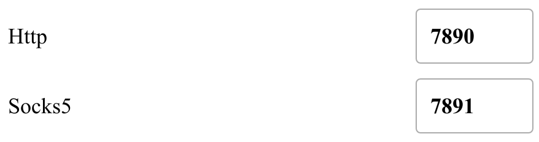

### Proxy mode change

Support change proxy mode to `Global`,`Rule` or `Direct`.

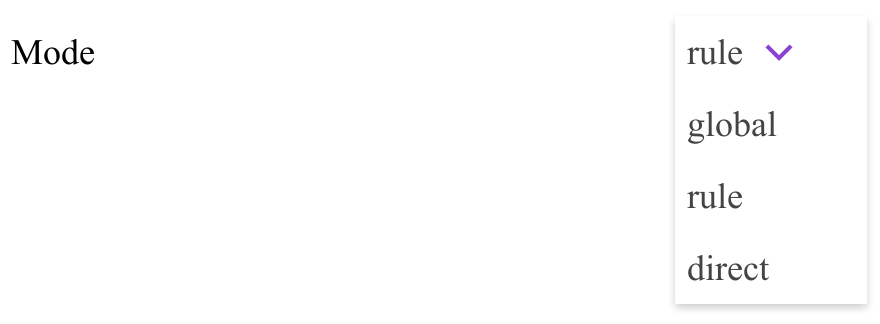

## Proxies

### Proxy nodes latencies status

Latency status are divided into four levels:

**0-200ms**, **200-500ms**, **500+ms**, **timeout**

Corresponding to these colors respectively:

The length of the status bar indicates the percentage of the number of corresponding status nodes to the total number of nodes.

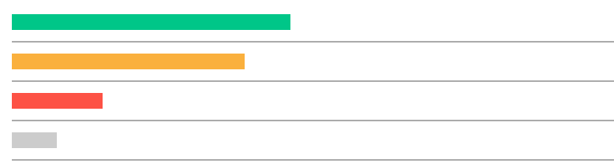

### Proxy nodes details

Expand the panel to view the details of the proxy nodes.

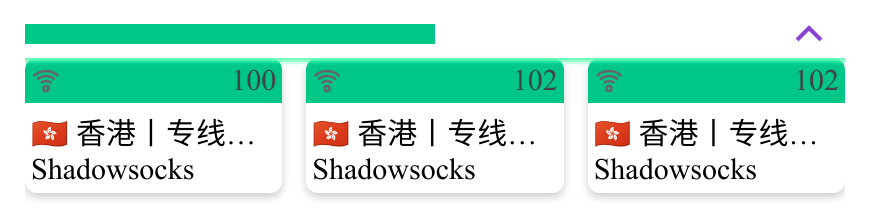

### Policies management

Select a policy group to view details.

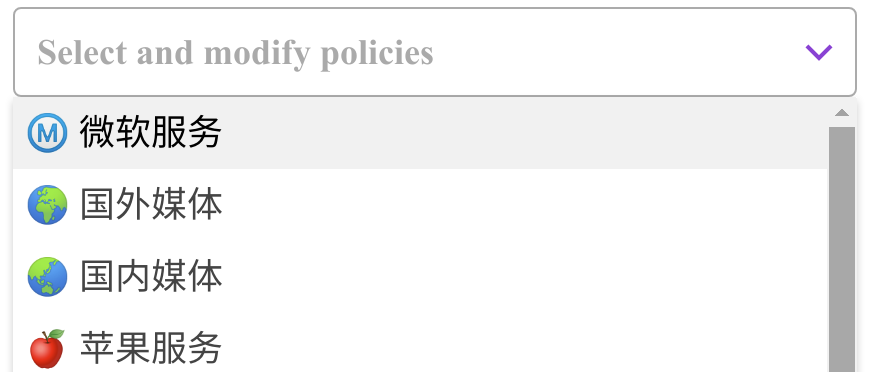

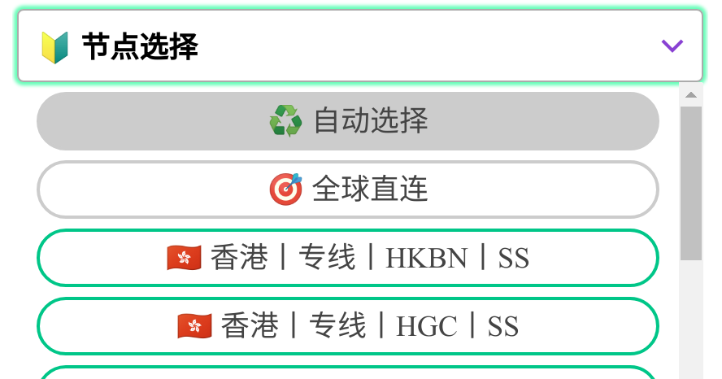

Proxy nodes are arranged in order of latency.

Background highlighted proxy node indicates the one now using, click another to change.

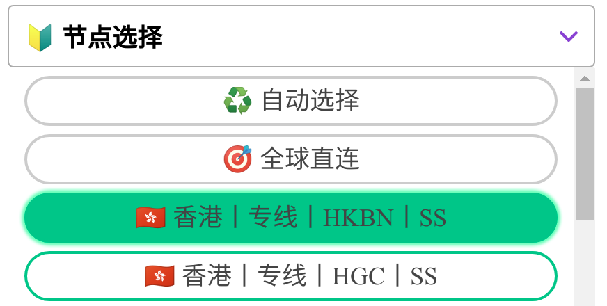

## Profiles

### Download from subscription link

Enter the subscription link address to download the profile.

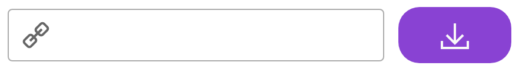

### Select a profile

The profiles are displayed as cards as follows:

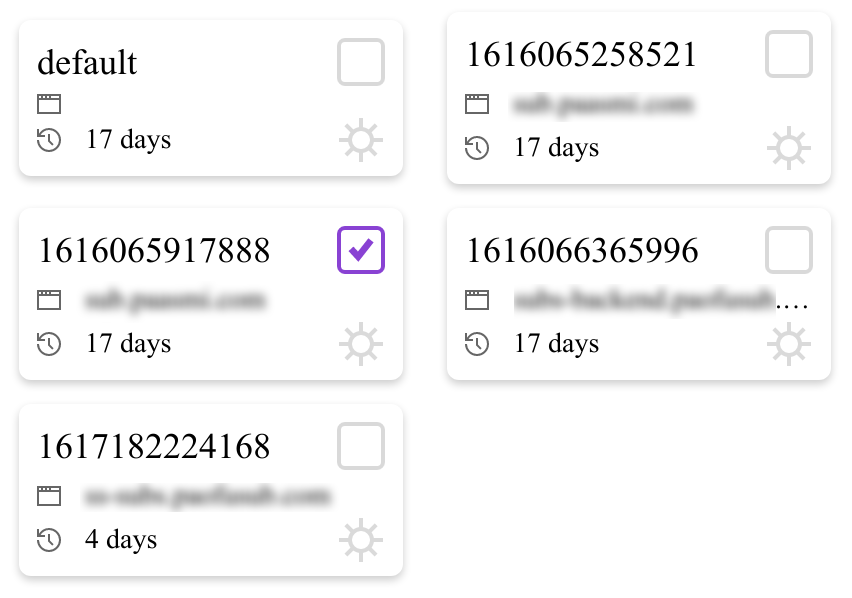

Click on the checkbox to choose a profile for clash to use.

## Logs

Clash logs are shown in this panel.

### Log level

Clash has four log levels: **info**, **warning**, **error**, **debug**.

Select a log level to view different level logs.

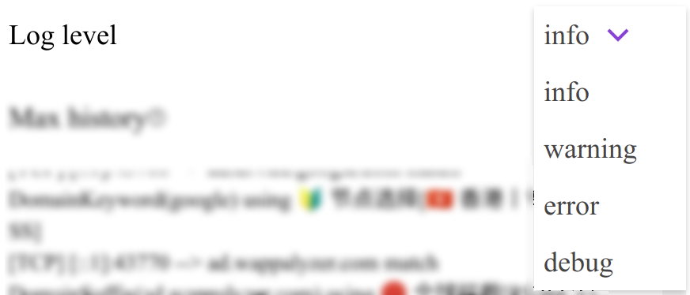

### Max history

**Max history** limits the max count of logs, set to 200 as default. The range is between **100-2000**

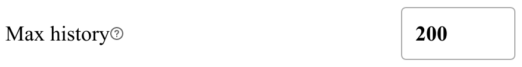

### Log details

Logs are printed here.

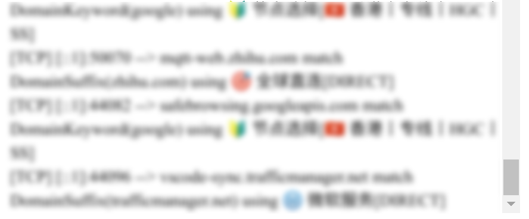

## Connections

Clash connections information panel.

### Sort connections

Connections information are not sorted by default. Choose a sort type to sort connection information.

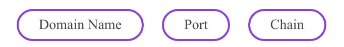

Click this icon to switch ascending and descending order

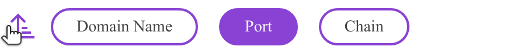

### Filter connections

When sorting is enabled, input filter text to match corresponding connections.

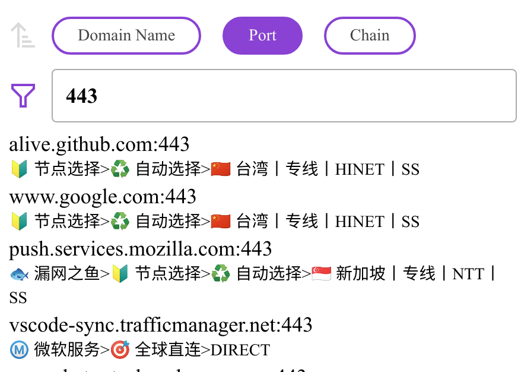

## Status bar

### Network activity

Realtime network activity is displayed here.

### About & Repository

Information of this app and repository address.

